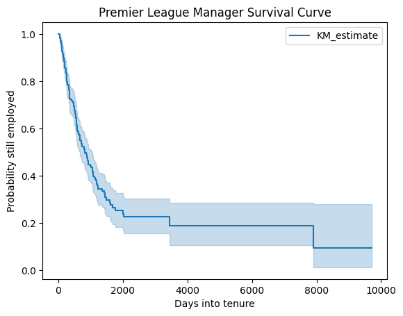
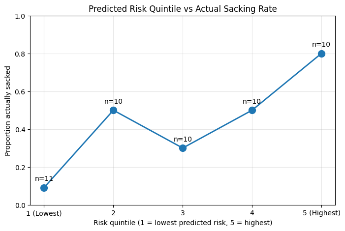
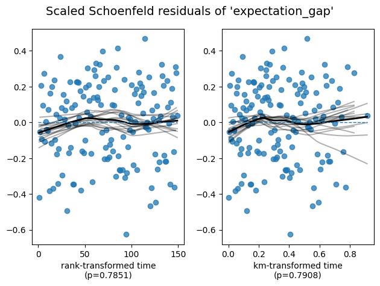

# Premier League Manager Sacking Risk Model

A survival analysis model I built to estimate a Premier League manager's real-time risk of being sacked, using match results, tenure history, and pre-season expectations. Built with SQL (BigQuery), Python (lifelines, statsmodels), and an interactive Tableau dashboard.

🔗 **[Live Dashboard](https://public.tableau.com/app/profile/brian.connell3646/viz/PremierLeagueManagerSackingRiskModel/PremierLeagueManagerSackingRiskModel)**

---

## Why I built this

Premier League managers get sacked constantly, and it always looks reactive — one bad result and suddenly a manager's gone. I wanted to find out if that's actually true, or if there's a more predictable pattern underneath all the headlines. So I built a survival/hazard model that estimates a manager's risk of dismissal in real time, based on match results, how long they've been in the job, and how they're doing relative to what was expected of them at the start of the season. I tested it against 21 seasons of Premier League history (2005/06–2025/26) and put the results into a Tableau dashboard that shows current sacking risk across the league. I've tried to be upfront throughout about what the model can and can't do — it doesn't know anything about boardroom politics, ownership changes, or the other off-pitch stuff that genuinely affects these decisions.

## Data

- **Match results:** [football-data.co.uk](https://www.football-data.co.uk/) — 21 seasons, roughly 7,980 matches
- **Manager tenure history:** Wikipedia's "List of Premier League managers" page — 359 tenure records, which I manually went through and classified one by one
- **Pre-season expectation:** each team's final league position from the previous season. I'd originally planned to use historical bookmaker odds for this, but after digging around I couldn't find a clean, structured dataset of pre-season outright odds going back 21 seasons — it just doesn't exist in a usable form. More on that below.

## How I built it

### Getting the data into shape (SQL / BigQuery)

I pulled the 21 seasons of match data into one table, then had to build a crosswalk to fix a naming mismatch — Wikipedia uses full club names ("Manchester United") while football-data.co.uk uses shortened ones ("Man United"). Missing this cost me a chunk of debugging time when a join silently dropped over half my matches.

For the tenure data, I went through all 359 records and classified each one as a sacking, not a sacking, or excluded (some tenures technically overlapped my date window but the actual departure happened while the club was down in the Championship, so those got left out of the sacking counts). The rule I settled on: if a manager left because of poor results, it counts as a sacking even if the club dressed it up as "mutual consent." If they left after genuine success, for political/boardroom reasons, or for health reasons, it doesn't count, regardless of how it's framed.

From there I built the actual features: rolling form (points from the last 5 and 10 matches, resetting whenever a new manager takes over), live league position, the gap between actual and expected position, and how long a manager had been in the job at any given point. All of that got joined into one table — `model_input` — with about 15,868 rows, one per team per match.

### Modeling (Python)

I started with a **Kaplan-Meier curve** just to get a baseline picture with no features involved. Median survival time came out at **827 days**, around 2.3 years — higher than the "a year and you're out" narrative you hear a lot, mostly because a handful of very long-tenured managers pull the median up.



Then I fit a **Cox Proportional Hazards model** with three features:

| Feature | Hazard Ratio | p-value | What it means |
|---|---|---|---|
| Points in last 5 matches | 0.81 | <0.005 | Each extra point cuts sacking risk by about 19% |
| League position | 0.94 | 0.01 | Higher up the table = meaningfully lower risk |
| Expectation gap | 1.02 | 0.28 | Not statistically significant |

I also ran a **logistic regression** as a cross-check, predicting "sacked in the next 5 matches: yes/no" on the same features. It told the same story: form and position matter, expectation gap doesn't once you already know those two.

### Validation

I held out the most recent 3 seasons (21/22 through 25/26 — 51 tenures) and refit the model on everything before that, just to make sure I wasn't accidentally training and testing on the same data. Concordance came out at **0.667 on the held-out seasons**, actually slightly better than the 0.630 it got on its own training data, which was a relief to see.

I also checked calibration — grouping managers by predicted risk and checking how many were actually sacked. The highest-risk group got sacked 70-80% of the time versus under 10% for the lowest-risk group, so the model's clearly picking up something real at the extremes. The middle of the distribution was noisier, which I think comes down to only having 51 tenures in the test set rather than the model being unreliable there.



### The dashboard

The final piece scores all 20 current Premier League managers using the fully-trained model against this season's results so far. It's got a current risk leaderboard, a chart showing how any manager's risk has moved over their whole tenure (pick from a dropdown), and a plain-language panel explaining what's actually driving the numbers.

## What I found

1. **Recent form is by far the strongest predictor.** Both models agreed on this, and it held up on seasons the model had never seen before.
2. **League position matters on its own**, separately from recent form — being higher up the table lowers risk even accounting for how the last few games went.
3. **Pre-season expectation doesn't predict sacking risk**, once you already know form and position. I wasn't expecting this going in, but it showed up consistently in both models, so I'm treating it as a real finding rather than noise.
4. **The model's good at spotting clear danger, less good at fine-grained ranking.** It separates the obvious high-risk and low-risk cases well, but the middle third is harder to pin down — probably a sample size issue more than anything else.
5. **How long someone's been in the job matters on its own, independent of performance.** Managers in roughly their first 3-5 years carry more background risk than the numbers alone would suggest, just because that's when most sackings happen historically. Very long-serving managers are rarely let go regardless of form.

## Limitations (being honest about this)

- **I couldn't find real pre-season odds data.** I looked for a structured dataset of historical title/relegation odds and it just isn't out there in a usable form for a project like this. I used prior-season final position instead, which is a reasonable stand-in but not what I originally planned to use.
- **The proportional hazards assumption doesn't fully hold for league position** (p=0.035–0.049 on the test lifelines runs) — its effect on risk seems to fade the longer a tenure goes on, which a standard Cox model can't really capture.

  
- **21 tenures got excluded from the sacking counts** because the actual departure happened while the club was in the Championship, not the Premier League, even though part of the tenure overlapped my dataset. Those matches still feed into the feature engineering, just not the sacking/non-sacking labels.
- **The very first season in my dataset (05/06) has no expectation data**, since there's nothing before it to calculate a "previous season" position from.
- **"Risk in the next 5 matches" is really "risk in the next 35 days,"** since the model works in calendar time and I assumed roughly weekly fixtures. That assumption gets shakier around international breaks or midweek cup fixtures.
- **Early-season predictions for 2026/27 are provisional** — some of the new appointments only have 4 matches of data behind them, which is a much smaller window than the model was built around.
- **This model has no idea about boardroom politics, ownership changes, or finances**, all of which genuinely drive real sacking decisions. It's one input into the picture, not the whole picture.

## Repo structure

```
├── data/
│   ├── raw/           # Original source CSVs, untouched
│   ├── processed/     # Cleaned and joined tables
│   └── live/          # Current-season data, used only to score the dashboard, never to retrain
├── sql/                # All the BigQuery SQL, in the order I ran it
├── notebooks/          # The Python notebook — modeling, validation, live scoring
├── dashboard/          # Dashboard exports and chart images
└── README.md
```

## Reproducing this

1. Download 21 seasons of Premier League match data from football-data.co.uk (E0 division)
2. Run the SQL scripts in `/sql`, in order, against a BigQuery project
3. Export `model_input.csv` and open `/notebooks/pl_manager_sacking_model.ipynb` in Google Colab
4. `!pip install lifelines`, then run all cells

---

*Sackings in the Premier League always look chaotic from the outside. Turns out a good chunk of it is actually predictable from just results and league position — pre-season hype, less so.*
